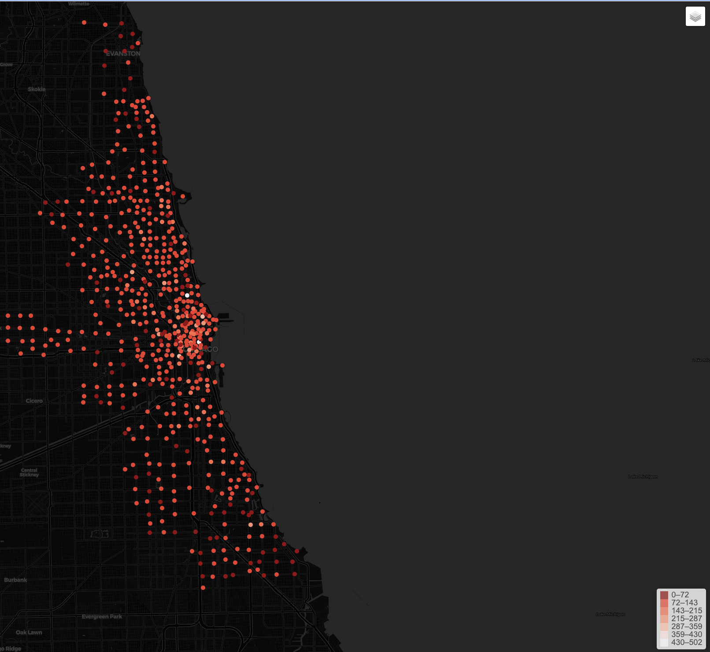

# Report for Assiment 1 
> - PanZhiQing 24037665g 
> - 2024.9.14 --> 
> - repo : https://github.com/pzq123456/LSGI524A
## Task1 [25 points]:  
### (1) How many valid bicycle trips were documented on 25 July 2019? 
20187
### (2) How many bike stations were used on that day? 
535
### (3) How many unique bikes were used? 
3822

## Task2 [25 points]: 

| Indicator          |  Trip duration(s)  | Trip distance(m)  |
|  ---               |      ---           |      ---          | 
| Max value          | 31243              | 20083.35          |
| Min value          | 61                 | 103.67            |
| Median             | 799.0              | 1840.42           |
| Mean               | 1187.6403626096003 | 2460.647581079681 |
| 25% percentile     | 465.0              | 1107.48           |
| 75% percentile     | 1403.0             | 3202.5            |
| Standard deviation | 1400.9766896637864 | 1950.106137982676 |

> - Trip distance may be zero. I found 885 trips have the same original and destination station. Those can be considered as invalid records. Ignoring them, I get the results above, and you can check the original results below.
> 
>   | Indicator          |  Trip distance(m)  |
>   |  ---               |       ---          | 
>   | Max value          | 20083.35           |
>   | Min value          | 0.0                |
>   | Median             | 1753.74            |
>   | Mean               | 2352.772557091197  |
>   | 25% percentile     | 1016.56            |
>   | 75% percentile     | 3096.995           |
>   | Standard deviation | 1972.3091923774828 |

## Task3 [25 points]:  
Data visualization based on the processed bike-sharing data. Please use the skills you have gained in data  visualization  to  present  answers  to  the  following  questions.  Both  figures  and  corresponding descriptions should be included in your report. 

### (1) How does the number of departure trips change over 24 hours? Is there any rhythm or pattern?  

> figure 1: The number of departure trips over 24 hours. The x-axis represents the hour of the day, and the y-axis represents the number of departure trips. 

There are two peaks at around 8 am and 5 pm, and the peak around 5 pm is the highest, which may be due to people using shared bicycles when going to and from work. The usage is minimal in the early morning, which may be due to most people sleeping.

### (2) What is the distribution of the number of departure trips at different stations? What about the distribution of arrival trips?

We can find St. Clair St & Erie St station, Racine Ave & Randolph St, Cityfront Plaza Dr & Pioneer Ct station have the most departure trips, and the most arrival trips are at the same stations. The most busy stations are mainly concentrated in the East of the city, especially in the downtown area(near the lake harbor).

For the departure distribution, the high number of departure trips is more dispersed specially than the arrival distribution. We can infer that living areas are more dispersed than working areas, and people may live in different areas but work in the same area.

> Figure 2: The spatial distribution of the number of departure trips at different stations. 

> Figure 3: The spatial distribution of the number of arrival trips at different stations.

I have make a simple web page to show the distribution of the number of departure and arrival trips at different stations. You can visit it [here](https://pzq123456.github.io/LSGI524A/assiment1/webpages/index.html) for more details. Click on each station to see the number of departure and arrival trips.

### (3) What is the distribution of the trip distance (measured as straight-line Euclidean distance)? What will you conclude from this distribution? 

Mean distance is about 2500 meters. Most trips are short, and the number of trips decreases as the distance increases. 

### (4) What is the distribution of the travel time (i.e., trip duration)?
1. For duration : 
    
    > Figure 2: The distribution of the travel time (i.e., trip duration). The x-axis represents the travel time, and the y-axis represents the frequency of trips.

    We can find that the most frequent travel time is around 500 seconds, and the distribution is right-skewed. Most trips are short, and the number of trips decreases as the travel time increases.

2. For start and end time : 
    
    > Figure 3: The distribution of the start and end time of trips. The x-axis represents the time, and the y-axis represents the frequency of trips. More light color represents more trips.
    
    > Figure 4: The heatmap of the start and end time of trips. The x-axis represents the start time, and the y-axis represents the end time. The color represents the number of trips. More light color represents more trips.

    We can find that there are two peaks at around 8 am and 5 pm, which is consistent with the results of the first question. Most trips are short, in another word, most trips have very close start and end times, and that is why the heatmap is mainly concentrated on the diagonal.

## Task4 [25 points]:  
Suppose the bike-sharing operator plans to manage efficiently by dividing bike stations into multiple service zones based on the distance between stations. Some clustering algorithms (e.g., DBSCAN, SVM) could be useful for the operator.  

Please  refer  to  this  website  to  cluster  all  bike  stations  in  Chicago  using  the  Density-based  Spatial Clustering of Applications with Noise (DBSCAN) algorithm packaged in scikit-learn. The maximum distance between two stations is 600 meters, and the number of samples in a neighborhood for a point to be considered as a core point is 2 stations. The other parameters are set as default. Please list the number of clusters and the station ids in each cluster in your report.  

## Bonus for Task4 [+10 points]:  
Please visualize the clusters using matplotlib or any Python packages you prefer. Here is a reference about how to visualize clusters. If you complete this Bonus part, please embed the figure into your report.  