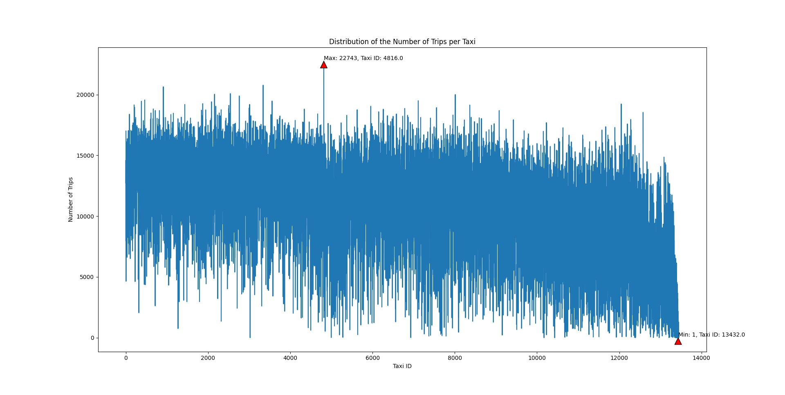

# [LSGI524A Assignment 2](https://github.com/pzq123456/LSGI524A/tree/main/assiment2) : Preprocessing and Exploratory Data Analysis of Large-Scale Taxi GPS Traces
> - PanZhiQing 24037665g 
> - repo : https://github.com/pzq123456/LSGI524A/tree/main/assiment2

## (1) How many unique taxis are there in this dataset, and how many trips are recorded?

- Before cleaning the data:
    ``` 
    Number of unique taxis: 13385
    Number of trips recorded: 147800095
    ```

- If we use the following principles to clean the data:
    - Remove the rows with invalid values(like the pick-up or drop-off time is not a valid unixtime, or bad lines)
    - Remove the rows out of the time window [2010-12-31 00:00:00, current time at the script running]
    - Remove the rows with the same pick-up and drop-off locations
    - Remove the rows with the same pick-up and drop-off time
    - Remove the rows with the drop-off time earlier than the pick-up time
    - Remove the rows with the pick-up or drop-off locations not in the intersection.csv

- After cleaning the data:
    ``` 
    Number of unique taxis: 13378
    Number of trips recorded: 145953717
    ```

<div STYLE="page-break-after: always;"></div>

## (2) What is the distribution of the number of trips per taxi? Who are the top performers?
We can use line chart to show the distribution of the number of trips per taxi. We can find that the number of trips per taxi is mainly distributed between 8000 and 14000.


Figure 1: Distribution of the number of trips per taxi(line chart)

The top performer is taxi 4816, which has 22743 trips. The last performer is taxi 13432, which has only 1 trip.

From the distribution of the number of trips per taxi, we can find that the number of trips per taxi is mainly distributed between 8000 and 14000.

The distribution of the number of trips per taxi is as follows:

|name|count|
|---|---|
|min |1.0|
|25% |8462.5|
|50% |11575.0|
|75% |13842.75|
|max |22743.0|
|mean |10909.980341|
|std |3896.740746|

For the whole distribution, we can use histogram to show the distribution of the number of trips per taxi. We can find that the main distribution obays the normal distribution roughly(right-skewed).


Figure 2: Histogram of the number of trips per taxi

<div STYLE="page-break-after: always;"></div>

## (3) How does the daily trip count (i.e., number of trips per day) change throughout the year? Any rhythm or seasonality?


Figure 3: Daily trip count throughout first quarter of the year


Figure 4: Monthly trip count throughout the year


Figure 5: Monthly trip count throughout the year(subplots)

From Figure 3, in general, August is the lowest order month globally, and March and October are two significant peaks.

From Figure 5, I will color each day of the week with a different color, and we can find some interesting patterns. In most cases, weekends and Mondays are the lowest points in the order volume (relatively), while Fridays and Saturdays are usually the days with the highest order volume. Generally speaking, the second Sunday of each week is a significant monthly low point. In addition, from Figure 3, we can find that 8.27 is a significant global low point. Considering that there are no special holidays in the Manhattan area, I guess this is due to weather reasons or data collection problems. In addition, from Figure 3, we can find that 12.24 is a significant low point, because this day is Christmas, so the order volume is significantly reduced.

<div STYLE="page-break-after: always;"></div>

## (4) What is the distribution of the number of departure trips at different locations (i.e., intersections)? What about the distribution of arrival trips? What will you conclude from these two distributions?


Figure 4: Bar chart of the number of departure and arrival trips at different locations

Figure 5: Distribution of the number of departure trips at different locations(Lighter color means more trips)

Figure 6: Distribution of the number of arrival trips at different locations(Lighter color means more trips)

For departure, there are two obvious hotspots on the map, located near Penn Station and Port Authority Bus Terminal in New York City. These two places are transportation hubs in New York City, so the number of departures is relatively high.


Figure 7: Details around Penn Station and Port Authority Bus Terminal

For arrival, there is only one obvious hotspot near Penn Station. However, there are many arrival times on several main north-south roads (such as Sixth Avenue, Eighth Avenue, Tenth Avenue, etc.), which may be due to the large number of hotels, shopping malls, etc. on these roads, so the number of arrivals is relatively high.
> - You can check the website for the interactive map: https://pzq123456.github.io/LSGI524A/assiment2/webpages/index.html
> - the visualization code can be found in the link: https://github.com/pzq123456/LSGI524A/tree/main/assiment2/webpages

<div STYLE="page-break-after: always;"></div>

## (5) How does the number of trips change over time in a day? (You will be given three dates randomly selected from the dataset, and then plot the hourly variation of trips from the perspective of local time).
> - 16,PAN,Zhiqing,2011/3/6,2011/3/12,2011/9/1

<!-- assiment2\img\hourly_trip_count_2011-03-06.png -->
### 2011/3/6

Figure 8: Hourly variation of trips on 2011/3/6

### 2011/3/12

Figure 9: Hourly variation of trips on 2011/3/12

### 2011/9/1

Figure 10: Hourly variation of trips on 2011/9/1

From the hourly variation of trips, we can find that the three selected days all have three obvious peaks (0:00, 11:00, 18:00), and there is also an obvious global low point (6:00). This is related to the daily routine of most people. 11:00 is the time for people's lunch activities (going out for lunch, appointments, etc.), 18:00 is generally related to arrangements after get off work, and around 0:00 may be related to night shifts and night travel.

<div STYLE="page-break-after: always;"></div>

## (6) What is the probability distribution of the trip distance (measured as straight-line distance)? How about travel time (i.e., trip duration)? What will you conclude from these two distributions?


Figure 11: Probability distribution of the trip distance

From the probability distribution of the trip distance, we can find that the peak is located near 2000 meters, which means that most of the trip distances are concentrated in this range. The distribution is symmetric, and the tails on both sides gradually decrease to near zero, indicating that extreme trip distances are less likely to occur.


Figure 12: Probability distribution of the trip duration

<div STYLE="page-break-after: always;"></div>

Most of the trip durations are concentrated around 1000 seconds (about 16 minutes), and the distribution presents a symmetric bell shape, with the tails on both sides gradually decreasing to near zero, indicating that extreme long or short trip durations are less likely to occur.

## Appendix
- The code used in this assignment can also be found in the link: https://github.com/pzq123456/LSGI524A/blob/main/assiment2/src/clean.py

```python
import os
import dask.dataframe as dd
from dask.diagnostics import ProgressBar
import numpy as np
import pandas as pd
import matplotlib.pyplot as plt
import seaborn as sns
from pyproj import Transformer
from scipy.stats import norm


transformer = Transformer.from_crs("EPSG:4326", "EPSG:26916", always_xy=True)

# ./data/
PARENT_PATH = os.path.join(os.path.dirname(__file__), '..', 'data') # path to data directory
PATH1 = os.path.join(PARENT_PATH, 'taxi_id.csv.bz2') # path to the zipped file
PATH2 = os.path.join(PARENT_PATH, 'intersections.csv') # path to the zipped file

TEST = os.path.join(PARENT_PATH, 'test.csv') 
SAVE_TEST = os.path.join(PARENT_PATH, 'test_save.csv') # path to the unzipped file

SAVE_PATH1 = os.path.join(PARENT_PATH, 'taxi_id.csv') # path to the unzipped file
SAVE_PATH2 = os.path.join(PARENT_PATH, 'taxi_id_clean.csv') # path to the cleaned file
SAVE_PATH3 = os.path.join(PARENT_PATH, 'trip_count_per_taxi.csv') # path to the trip count per taxi file
SAVE_PATH4 = os.path.join(PARENT_PATH, 'daily_trip_count.csv') # path to the daily trip count file

SAVE_PATH5 = os.path.join(PARENT_PATH, 'departure_trip_count.csv') # path to the departure trip count file
SAVE_PATH6 = os.path.join(PARENT_PATH, 'arrival_trip_count.csv') # path to the arrival trip count file

SAVE_PATH7 = os.path.join(PARENT_PATH, 'distance_duration.csv') # path to the distance and duration file

SAVE_IMGS = os.path.join(PARENT_PATH, '..', 'img') # path to the img directory


# Q1 : How many unique taxis are there in this dataset, and how many trips are recorded?
def q1(stage_name):
    # stage_name = 'before' or 'after'
    with ProgressBar():
        if stage_name == 'before':
            print("Before cleaning:")
            print(f'Number of unique taxis: {taxi_df["taxi_id"].nunique().compute()}')
            print(f'Number of trips recorded: {taxi_df["taxi_id"].count().compute()}')
        elif stage_name == 'after':
            print("After cleaning:")
            print(f'Number of unique taxis: {cleaned_taxi_df["taxi_id"].nunique().compute()}')
            print(f'Number of trips recorded: {cleaned_taxi_df["taxi_id"].count().compute()}')

def clean(taxi_df, inter_df, SAVE_PATH2):
    valid_intersections = set(inter_df['id'])

    taxi_df = taxi_df.dropna()
    taxi_df = taxi_df.drop_duplicates()

    # 规则1：检查时间格式是否为有效的 Unix 时间
    current_timestamp = pd.Timestamp.now().timestamp()  # 获取当前 Unix 时间戳
    # 获取 2010 年 12 月 31 日的 Unix 时间戳
    start_timestamp = pd.Timestamp(year=2010, month=12, day=31).timestamp()
    taxi_df = taxi_df[
        (taxi_df['pick_up_time'] > start_timestamp) & (taxi_df['pick_up_time'] < current_timestamp) &
        (taxi_df['drop_off_time'] > start_timestamp) & (taxi_df['drop_off_time'] < current_timestamp)
    ]


    # 删除时间无法解析的行
    taxi_df = taxi_df.dropna(subset=['pick_up_time', 'drop_off_time'])

    # 规则2：pick_up_time 应当晚于 drop_off_time
    taxi_df = taxi_df[taxi_df['pick_up_time'] < taxi_df['drop_off_time']]

    # 规则3：检查 intersection 是否有效
    taxi_df = taxi_df[taxi_df['pick_up_intersection'].isin(valid_intersections) & 
                      taxi_df['drop_off_intersection'].isin(valid_intersections)]

    # 规则4：起点与终点不能相同
    taxi_df = taxi_df[taxi_df['pick_up_intersection'] != taxi_df['drop_off_intersection']]
    # 按照 pick_up_time 和 drop_off_time 排序
    taxi_df = taxi_df.sort_values(by=['pick_up_time', 'drop_off_time'])
    # 启动进度条
    with ProgressBar():
        # 触发计算并保存清洗后的数据
        cleaned_taxi_df = taxi_df.compute()
        cleaned_taxi_df.to_csv(SAVE_PATH2, index=False)
    
    print("Data cleaning completed.")

def visualize_q2(taxi_trip_count):
    # 打印最大最小值，以及中位数，上下四分位数及对应的id
    print(taxi_trip_count['count'].describe())


    print("drawing histogram...")

    # 根据行程数量排序
    taxi_trip_count = taxi_trip_count.sort_values(by='count', ascending=False).reset_index(drop=True)
    # 获取最大值和最小值对应的 taxi_id 和 count
    max_taxi_id = taxi_trip_count['taxi_id'].iloc[0]
    max_count = taxi_trip_count['count'].iloc[0]

    min_taxi_id = taxi_trip_count['taxi_id'].iloc[-1]
    min_count = taxi_trip_count['count'].iloc[-1]

    # 绘制折线图 X: taxi_id, Y: count
    plt.figure(figsize=(10, 6))
    sns.lineplot(data=taxi_trip_count, x='taxi_id', y='count')
    plt.title('Distribution of the Number of Trips per Taxi')
    plt.xlabel('Taxi ID')
    plt.ylabel('Number of Trips')

    # 在图上用箭头标出最大值和最小值对应的 taxi_id
    plt.annotate(f'Max: {max_count}, Taxi ID: {max_taxi_id}', xy=(max_taxi_id, max_count), xytext=(max_taxi_id, max_count+100), arrowprops=dict(facecolor='red', shrink=0.05))
    plt.annotate(f'Min: {min_count}, Taxi ID: {min_taxi_id}', xy=(min_taxi_id, min_count), xytext=(min_taxi_id, min_count+100), arrowprops=dict(facecolor='red', shrink=0.05))

    plt.show()

def q2():


    with ProgressBar():
        taxi_trip_count = cleaned_taxi_df['taxi_id'].value_counts().compute()
        taxi_trip_count.to_csv(SAVE_PATH3)
    
    # 可视化
    # visualize_q2(taxi_trip_count)

def visualize_q3(daily_trip_count):
    # id,pick_up_date,count
    # 0,2011-01-01,147515
    # 1,2011-01-02,127657

    # 绘制每日行程数量的折线图
    plt.figure(figsize=(12, 6))
    sns.lineplot(data=daily_trip_count, x='pick_up_date', y='count')
    plt.title('Daily Trip Count Throughout the Year')
    plt.xlabel('Date')
    plt.ylabel('Trip Count')
    # MaxNLocator
    plt.gca().xaxis.set_major_locator(plt.MaxNLocator(20)) 
    # 旋转 x 轴标签
    plt.xticks(rotation=45)
    plt.show()

def visualize_q3_2(daily_trip_count):
    # 以月为单位绘制每日行程数量的折线图 作为一组图
    # 按照月份分组 pandas dataframe
    daily_trip_count['month'] = pd.to_datetime(daily_trip_count['pick_up_date']).dt.month
    # 计算每月的行程数量
    monthly_trip_count = daily_trip_count.groupby('month')['count'].sum().reset_index()
    # 绘制每月行程数量的折线图
    plt.figure(figsize=(12, 6))
    sns.lineplot(data=monthly_trip_count, x='month', y='count')
    plt.title('Monthly Trip Count Throughout the Year')
    plt.xlabel('Month')
    plt.ylabel('Trip Count')
    # plt.show()
    # save to file
    # print(SAVE_IMGS)
    plt.savefig(os.path.join(SAVE_IMGS, 'monthly_trip_count.png'))

def visualize_q3_3(daily_trip_count):
    # 确保数据类型正确
    daily_trip_count['pick_up_date'] = pd.to_datetime(daily_trip_count['pick_up_date'], errors='coerce')
    daily_trip_count['count'] = pd.to_numeric(daily_trip_count['count'], errors='coerce')

    # 移除无效数据
    daily_trip_count.dropna(subset=['pick_up_date', 'count'], inplace=True)

    # 添加月份和星期几列
    daily_trip_count['month'] = daily_trip_count['pick_up_date'].dt.month
    daily_trip_count['day_of_week'] = daily_trip_count['pick_up_date'].dt.dayofweek

    # 定义一周七天的颜色和标签
    week_colors = sns.color_palette("husl", 7)
    week_labels = ['Monday', 'Tuesday', 'Wednesday', 'Thursday', 'Friday', 'Saturday', 'Sunday']

    # 创建 3x4 的子图布局
    fig, axes = plt.subplots(3, 4, figsize=(20, 15))
    
    for month in range(1, 13):
        month_data = daily_trip_count[daily_trip_count['month'] == month]
        ax = axes[(month - 1) // 4, (month - 1) % 4]  # 获取子图位置
        sns.lineplot(data=month_data, x='pick_up_date', y='count', ax=ax, label='Daily Count', color='gray')
        
        # 绘制每个点（按星期几着色）
        for day in range(7):
            day_data = month_data[month_data['day_of_week'] == day]
            ax.scatter(day_data['pick_up_date'], day_data['count'], color=week_colors[day], label=week_labels[day] if month == 1 else "") 
        
        ax.set_title(f'Month {month}')
        ax.set_xlabel('Date')
        ax.set_ylabel('Trip Count')
        ax.xaxis.set_major_locator(plt.MaxNLocator(10))
        ax.tick_params(axis='x', rotation=45)

    # 设置图例，只显示一次
    handles, labels = axes[0, 0].get_legend_handles_labels()
    
    # 过滤重复的标签，确保图例清晰
    unique_labels = []
    unique_handles = []
    for handle, label in zip(handles, labels):
        if label not in unique_labels:
            unique_labels.append(label)
            unique_handles.append(handle)

    fig.legend(unique_handles, unique_labels, loc='upper right', title='Day of the Week')
    
    plt.tight_layout()
    plt.savefig(os.path.join(SAVE_IMGS, 'monthly_trip_count_subplots.png'))

def q3():
    with ProgressBar():
        # 1. 从 pick_up_time 中提取日期
        cleaned_taxi_df['pick_up_date'] = dd.to_datetime(cleaned_taxi_df['pick_up_time'], unit='s').dt.date
        # 2. 计算每天的行程数量
        daily_trip_count = cleaned_taxi_df['pick_up_date'].value_counts().compute()
    
    # 按照时间排序
    daily_trip_count = daily_trip_count.sort_index().reset_index()
    # 3. 保存结果
    daily_trip_count.to_csv(SAVE_PATH4)


def q4():

    with ProgressBar():
        # 计算每个起点的行程数量
        departure_trip_count = cleaned_taxi_df['pick_up_intersection'].value_counts().compute()
        # 计算每个终点的行程数量
        arrival_trip_count = cleaned_taxi_df['drop_off_intersection'].value_counts().compute()

    departure_trip_count.to_csv(SAVE_PATH5)
    arrival_trip_count.to_csv(SAVE_PATH6)
    print("Data saved.")

def visualize_q4(departure_trip_count, arrival_trip_count):


    # 降序排序
    departure_trip_count = departure_trip_count.sort_values(by='count', ascending=False).reset_index(drop=True)
    arrival_trip_count = arrival_trip_count.sort_values(by='count', ascending=False).reset_index(drop=True)

    max_departure_id = departure_trip_count['pick_up_intersection'].iloc[0]
    max_departure_count = departure_trip_count['count'].iloc[0]

    max_arrival_id = arrival_trip_count['drop_off_intersection'].iloc[0]
    max_arrival_count = arrival_trip_count['count'].iloc[0]

    # 绘制折线图 在同一张图上绘制出发点和终点的行程数量
    plt.figure(figsize=(12, 6))
    sns.lineplot(data=departure_trip_count, x='pick_up_intersection', y='count', label='Departure')
    sns.lineplot(data=arrival_trip_count, x='drop_off_intersection', y='count', label='Arrival')
    plt.title('Distribution of the Number of Departure and Arrival Trips')
    plt.xlabel('Intersection ID')
    plt.ylabel('Trip Count')
    plt.legend()

    # 在图上用箭头标出最大值对应的 intersection_id
    plt.annotate(f'Max Departure: {max_departure_count}, Intersection ID: {max_departure_id}', xy=(max_departure_id, max_departure_count), xytext=(max_departure_id, max_departure_count+100), arrowprops=dict(facecolor='red', shrink=0.05))
    plt.annotate(f'Max Arrival: {max_arrival_count}, Intersection ID: {max_arrival_id}', xy=(max_arrival_id, max_arrival_count), xytext=(max_arrival_id, max_arrival_count+100), arrowprops=dict(facecolor='red', shrink=0.05))

    plt.show()

def q6():

    getProjectedDistance_Duration(cleaned_taxi_df, SAVE_PATH7)

def visualize_q6(distance_duration):

    # 拟合距离和时间的概率分布 并绘制 不绘制直方图 否则会很慢
    distance = distance_duration['distance']
    duration = distance_duration['duration']

    with ProgressBar():
        distance_dist = calculate_probability_distribution(distance)
        duration_dist = calculate_probability_distribution(duration)
    
        # 根据拟合的概率分布生成随机数
        distance_sample = distance_dist.rvs(size=1000)
        duration_sample = duration_dist.rvs(size=1000)

        # 绘制距离和时间的概率密度函数
        # 距离
        plt.figure(figsize=(12, 6))
        # sns.kdeplot(distance, label='Distance')
        sns.kdeplot(distance_sample, label='Fitted Distance')
        plt.title('Probability Distribution of Trip Distance')
        plt.xlabel('Distance(m)')
        plt.ylabel('Density')
        plt.legend()
        plt.show()

        # 时间
        plt.figure(figsize=(12, 6))
        # sns.kdeplot(duration, label='Duration')
        sns.kdeplot(duration_sample, label='Fitted Duration')
        plt.title('Probability Distribution of Trip Duration')
        plt.xlabel('Duration(s)')
        plt.ylabel('Density')
        plt.legend()
        plt.show()


def calculate_probability_distribution(data):
    # 计算均值和标准差
    mean = data.mean()
    std = data.std()
    # 使用正态分布拟合数据
    dist = norm(loc=mean, scale=std)
    return dist

def getProjectedDistance_Duration(df, SAVE_TEST):
    # 读取数据
    meta = pd.DataFrame({
            'taxi_id': pd.Series(dtype='float64'),
            'pick_up_time': pd.Series(dtype='float64'),
            'drop_off_time': pd.Series(dtype='float64'),
            'pick_up_intersection': pd.Series(dtype='float64'),
            'drop_off_intersection': pd.Series(dtype='float64'),
            'latitude_from': pd.Series(dtype='float64'),
            'longitude_from': pd.Series(dtype='float64'),
            'latitude_to': pd.Series(dtype='float64'),
            'longitude_to': pd.Series(dtype='float64'),
            'from_x_transformed': pd.Series(dtype='float64'),
            'from_y_transformed': pd.Series(dtype='float64'),
            'to_x_transformed': pd.Series(dtype='float64'),
            'to_y_transformed': pd.Series(dtype='float64'),
            'distance': pd.Series(dtype='int64'),
            'duration': pd.Series(dtype='int64')
        })

    with ProgressBar():
        df = df.map_partitions(transform_calculate_distance_and_duration, meta=meta)
        # 仅仅保留最后两列
        df = df[['distance', 'duration']]
        # 都转化为 int 类型
        df = df.astype('int64')
        df = df.compute().to_csv(SAVE_TEST, index=False)


# 定义一个用于在分块中处理坐标转换和距离计算的函数
def transform_calculate_distance_and_duration(partition):

    partition = partition.merge(inter_df, left_on='pick_up_intersection', right_on='id', how='left')
    partition = partition.rename(columns={'latitude': 'latitude_from', 'longitude': 'longitude_from'})
    partition = partition.drop(columns=['id'])

    partition = partition.merge(inter_df, left_on='drop_off_intersection', right_on='id', how='left')
    partition = partition.rename(columns={'latitude': 'latitude_to', 'longitude': 'longitude_to'})
    partition = partition.drop(columns=['id'])

    # 将经纬度转换为投影坐标
    from_x, from_y = transformer.transform(partition['latitude_from'].values, partition['longitude_from'].values)
    to_x, to_y = transformer.transform(partition['latitude_to'].values, partition['longitude_to'].values)


    # 计算欧氏距离
    distance = ((to_x - from_x) ** 2 + (to_y - from_y) ** 2) ** 0.5
    # 计算时间
    duration = partition['drop_off_time'] - partition['pick_up_time']

    partition['from_x_transformed'] = from_x
    partition['from_y_transformed'] = from_y
    partition['to_x_transformed'] = to_x
    partition['to_y_transformed'] = to_y

    partition['distance'] = distance
    partition['duration'] = duration

    return partition

def q5():
    # 2011/3/6,2011/3/12,2011/9/1
    # 选择三个日期
    dates = ['2011-03-06', '2011-03-12', '2011-09-01']
    with ProgressBar():
        for date in dates:
            print(f'Processing date: {date}')
            # 提取指定日期整日的记录
            daily_data = get_daily_data(cleaned_taxi_df, date)
            # save to csv
            plot_hourly_trip_count(daily_data, date)
            # print(f'Date: {date}, Number of trips: {len(daily_data)}')

def plot_hourly_trip_count(daily_data,date):
    # date 用于标题
    # 提取小时
    daily_data['hour'] = dd.to_datetime(daily_data['pick_up_time'], unit='s').dt.hour
    # 计算每小时的行程数量
    hourly_trip_count = daily_data['hour'].value_counts().compute()
    # 按照时间排序
    hourly_trip_count = hourly_trip_count.sort_index().reset_index()
    # print(hourly_trip_count.head())
    # 绘制每小时的行程数量
    plt.figure(figsize=(12, 6))
    sns.barplot(data=hourly_trip_count, x='hour', y='count')
    # 绘制趋势线
    sns.lineplot(data=hourly_trip_count, x='hour', y='count', color='red')
    plt.title(f'Hourly Trip Count on {date}')
    plt.xlabel('Hour')
    plt.ylabel('Trip Count')
    # plt.show() # 由于在远程服务器上无法显示图形，因此将图形保存为文件
    # 由于在远程服务器上无法显示图形，因此将图形保存为文件
    plt.savefig(os.path.join(PARENT_PATH,"..","img", f'hourly_trip_count_{date}.png'))
    print(f'Hourly trip count on {date} saved.')


# 定义帮助函数，提取指定日期整日的记录
def get_daily_data(df, date):
    # time range 前一天的 0 点到后一天的 0 点
    start_time = pd.Timestamp(date).timestamp()
    end_time = pd.Timestamp(date) + pd.Timedelta(days=1)
    end_time = end_time.timestamp()
    # 提取指定日期的记录
    daily_data = df[(df['pick_up_time'] >= start_time) & (df['pick_up_time'] < end_time)]
    return daily_data

if __name__ == '__main__':
    # 指定列名
    taxi_columns = ['taxi_id', 'pick_up_time', 'drop_off_time', 'pick_up_intersection', 'drop_off_intersection']
    inter_columns = ['id', 'latitude', 'longitude']
    taxi_dtypes = {
        'taxi_id': 'float64',
        'pick_up_time': 'float64',  # 原始的 Unix 时间戳
        'drop_off_time': 'float64',  # 原始的 Unix 时间戳
        'pick_up_intersection': 'float64',
        'drop_off_intersection': 'float64'
    }
    inter_dtypes = {
        'id': 'float64',
        'latitude': 'float64',
        'longitude': 'float64'
    }
    # 使用Dask读取CSV并指定列名
    taxi_df = dd.read_csv(SAVE_PATH1, header=None, names=taxi_columns, on_bad_lines='skip', dtype=taxi_dtypes)
    inter_df = pd.read_csv(PATH2, header=None, names=inter_columns, on_bad_lines='skip', dtype=inter_dtypes)


    q1('before')
    clean(taxi_df, inter_df, SAVE_PATH2)
    cleaned_taxi_df = dd.read_csv(SAVE_PATH2, header = 0 , on_bad_lines='skip', dtype=taxi_dtypes)
    q1('after')
    taxi_id,pick_up_time,drop_off_time,pick_up_intersection,drop_off_intersection
    q2()
    taxi_trip_count = pd.read_csv(SAVE_PATH3, header= 0) # pandas dataframe
    visualize_q2(taxi_trip_count)

    q3()
    daily_trip_count = pd.read_csv(SAVE_PATH4, header= 0) # pandas dataframe
    visualize_q3(daily_trip_count)
    visualize_q3_2(daily_trip_count)
    visualize_q3_3(daily_trip_count)


    q4()
    departure_trip_count = pd.read_csv(SAVE_PATH5, header= 0) # pandas dataframe
    arrival_trip_count = pd.read_csv(SAVE_PATH6, header= 0) # pandas dataframe
    visualize_q4(departure_trip_count, arrival_trip_count)

    q5()


    q6()
    distance_duration = dd.read_csv(SAVE_PATH7, header= 0) # pandas dataframe
    visualize_q6(distance_duration)
```