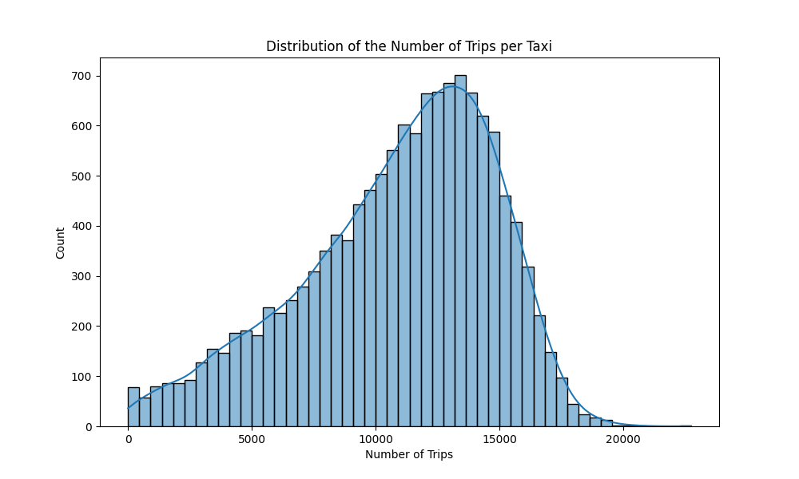
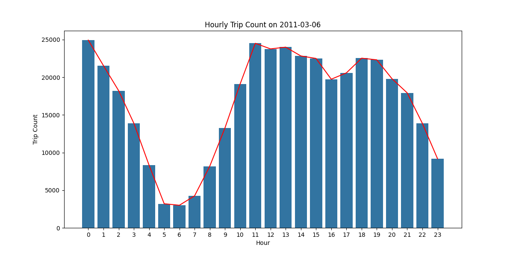
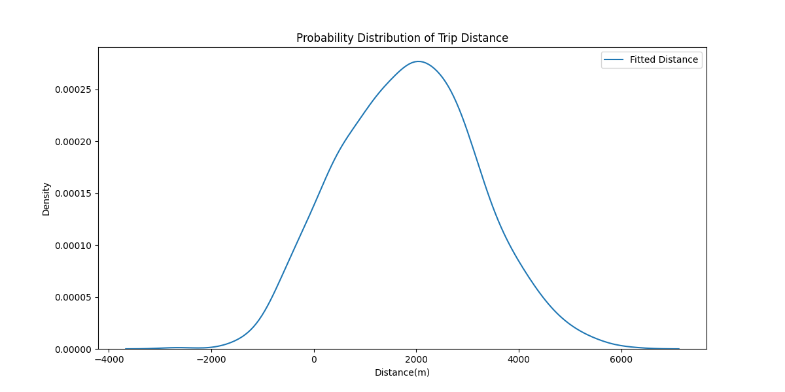

# [LSGI524A Assignment 2](https://github.com/pzq123456/LSGI524A/tree/main/assiment2) : Preprocessing and Exploratory Data Analysis of Large-Scale Taxi GPS Traces
> - PanZhiQing 24037665g 
> - repo : https://github.com/pzq123456/LSGI524A/tree/main/assiment2

## (1) How many unique taxis are there in this dataset, and how many trips are recorded?

- Before cleaning the data:
    ``` 
    Number of unique taxis: 13385
    Number of trips recorded: 147800095
    ```

- If we use the following principles to clean the data:
    - Remove the rows with invalid values(like the pick-up or drop-off time is not a valid unixtime, or bad lines)
    - Remove the rows out of the time window [2010-12-31 00:00:00, current time at the script running]
    - Remove the rows with the same pick-up and drop-off locations
    - Remove the rows with the same pick-up and drop-off time
    - Remove the rows with the drop-off time earlier than the pick-up time
    - Remove the rows with the pick-up or drop-off locations not in the intersection.csv

- After cleaning the data:
    ``` 
    Number of unique taxis: 13378
    Number of trips recorded: 145953717
    ```

## (2) What is the distribution of the number of trips per taxi? Who are the top performers?
We can use line chart to show the distribution of the number of trips per taxi. We can find that the number of trips per taxi is mainly distributed between 8000 and 14000.


Figure 1: Distribution of the number of trips per taxi(line chart)

The top performer is taxi 4816, which has 22743 trips. The last performer is taxi 13432, which has only 1 trip.

The distribution of the number of trips per taxi is as follows:

|name|count|
|---|---|
|min |1.0|
|25% |8462.5|
|50% |11575.0|
|75% |13842.75|
|max |22743.0|
|mean |10909.980341|
|std |3896.740746|

For the whole distribution, we can use histogram to show the distribution of the number of trips per taxi. We can find that the main distribution obays the normal distribution roughly(right-skewed).



Figure 2: Histogram of the number of trips per taxi

## (3) How does the daily trip count (i.e., number of trips per day) change throughout the year? Any rhythm or seasonality?


Figure 3: Daily trip count throughout first quarter of the year

## (4) What is the distribution of the number of departure trips at different locations (i.e., intersections)? What about the distribution of arrival trips? What will you conclude from these two distributions?


Figure 4: Bar chart of the number of departure trips at different intersections ID

Figure 5: Distribution of the number of departure trips at different locations(Lighter color means more trips)

Figure 6: Distribution of the number of arrival trips at different locations(Lighter color means more trips)

> - You can check the website for the interactive map: https://pzq123456.github.io/LSGI524A/assiment2/webpages/index.html
> - the visualization code can be found in the link: https://github.com/pzq123456/LSGI524A/tree/main/assiment2/webpages

## (5) How does the number of trips change over time in a day? (You will be given three dates randomly selected from the dataset, and then plot the hourly variation of trips from the perspective of local time).
> - 16,PAN,Zhiqing,2011/3/6,2011/3/12,2011/9/1

<!-- assiment2\img\hourly_trip_count_2011-03-06.png -->
### 2011/3/6

Figure 7: Hourly variation of trips on 2011/3/6

### 2011/3/12

Figure 8: Hourly variation of trips on 2011/3/12

### 2011/9/1

Figure 9: Hourly variation of trips on 2011/9/1


## (6) What is the probability distribution of the trip distance (measured as straight-line distance)? How about travel time (i.e., trip duration)? What will you conclude from these two distributions?


Figure 10: Probability distribution of the trip distance

Figure 11: Probability distribution of the trip duration

## References